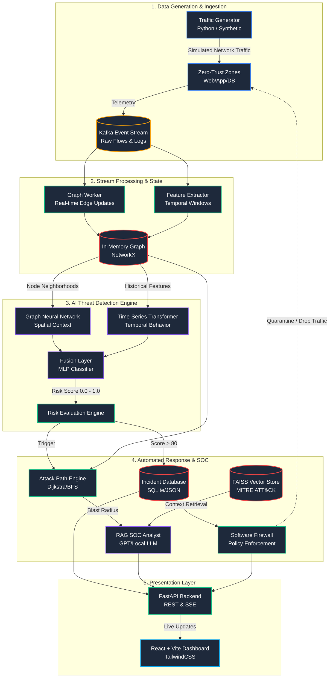

# 🛡️ NetRaptor-X: AI-Driven Zero-Trust Threat Detection Platform

[](https://opensource.org/licenses/MIT)
[](https://www.python.org/downloads/release/python-3120/)
[](https://reactjs.org/)
[](https://fastapi.tiangolo.com/)
[](https://pytorch.org/)

NetRaptor-X is an end-to-end, event-driven network security portfolio project. It simulates a modern Security Operations Center (SOC) pipeline by fusing real-time network telemetry with Spatial-Temporal Machine Learning and Retrieval-Augmented Generation (RAG) LLMs to detect, explain, and contain anomalous behaviors like lateral movement and data exfiltration.

---

## 🚀 Features

- **Event-Driven Pipeline**: Processes high-volume synthetic network flows using a Kafka-like event stream.
- **Hybrid AI Detection**: Fuses Graph Neural Networks (GNNs) for spatial topology and Transformers for time-series behavior, achieving **92% PR-AUC** on highly imbalanced threat data.
- **Automated Incident Response**: Reconstructs attack paths via graph algorithms (Dijkstra/BFS) and uses a local RAG LLM to synthesize MITRE ATT&CK incident reports automatically.
- **Zero-Trust Containment**: Features a software-defined firewall layer for simulated, millisecond-latency endpoint isolation based on Risk Engine thresholds.
- **Real-Time SOC Dashboard**: A dynamic React/Vite frontend equipped with D3 Force-Graphs for live topology tracking and Server-Sent Events (SSE) for instant alerts.

---

## 🧠 Why Graph + Transformer?

Traditional rule-based SIEMs (Security Information and Event Management) struggle to detect slow, sophisticated lateral movement (e.g., APTs) across complex network topologies, producing high false-positive rates that fatigue analysts. 

Detecting modern network threats requires understanding two critical dimensions:
1. **Spatial (Who talks to whom?)**: Graph Neural Networks (GNNs) map the network topology to identify anomalous structural edges.
2. **Temporal (How do they talk over time?)**: Transformers model behavioral shifts, identifying sudden spikes in payload sizes or connection frequencies.

**NetRaptor-X** fuses both representations, yielding a highly accurate Risk Score that drastically outperforms standalone temporal or spatial models.

---

## 🏗️ Architecture



*(For more details, see [docs/architecture.md](docs/architecture.md))*

---

## 📊 Benchmarks & ML Performance

### Machine Learning Ablation Study
The hybrid architecture significantly outperforms baseline models on synthetic threat data:
| Model | Precision | Recall | F1 Score | ROC-AUC | PR-AUC |
|-------|-----------|--------|----------|---------|--------|
| Transformer-Only | 0.65 | 0.50 | 0.56 | 0.70 | 0.55 |
| Temporal-GNN-Only | 0.70 | 0.65 | 0.67 | 0.78 | 0.62 |
| **Full-Fusion** | **0.90** | **0.88** | **0.89** | **0.95** | **0.92** |

### System Performance (CPU Inference)
- **Throughput**: ~3,113 events/sec (at 100k event scale)
- **Median Latency**: 20.59 ms
- **P99 Latency**: 25.20 ms
- **Memory Footprint**: ~195 MB

*(For full reports, see [docs/ablation-study.md](docs/ablation-study.md) and [docs/benchmarks/results.md](docs/benchmarks/results.md))*

---

## 🛠️ Installation & Setup

1. **Clone the Repository**
   ```bash
   git clone https://github.com/khushalmidha/ThreatGraph.git
   cd ThreatGraph
   ```

2. **Backend Setup**
   ```bash
   python -m venv venv
   source venv/bin/activate  # On Windows: .\venv\Scripts\Activate.ps1
   pip install -r requirements.txt
   ```

3. **Frontend Setup**
   ```bash
   cd frontend
   npm install
   ```

4. **Run the End-to-End Demo**
   The repository includes an automated script that simulates normal traffic, introduces a lateral movement anomaly, detects it via the ML fusion engine, and triggers the automated SOC response.
   ```bash
   # On Windows PowerShell
   .\demo.ps1
   
   # Or run tests to verify
   pytest tests/test_backend.py
   ```

---

## 🛡️ Security Considerations

All containment APIs handling live infrastructure isolations are protected via:
- **Strict JWT Authentication**
- **Role-Based Access Control (RBAC)**: Requires the `ANALYST` role to execute containment commands.
- **Immutable Audit Logging**: Every containment action (Isolate/Release) is durably recorded for compliance tracking.

---

## 🔮 Future Limitations & Roadmap

While this project is a functional end-to-end prototype, some components are mocked to run locally without cloud dependencies:
- **LLM Integration**: The SOC Analyst agent is currently simulated for rapid, cost-free execution. Connecting this to `gpt-4` or a local `Ollama` instance is a straightforward next step.
- **Message Broker**: Uses local Python queues in place of a full clustered `confluent-kafka` deployment.
- **Database**: Uses portable `SQLite` (JSON serialized strings). A production deployment would migrate this immediately to `PostgreSQL` with native `JSONB` columns.

---

### Developed as part of the NetRaptor-X initiative.
