# NetRaptor-X: AI-Driven Zero-Trust Threat Detection Platform

## Overview
NetRaptor-X is a defensive network security portfolio project designed to demonstrate an end-to-end modern SOC (Security Operations Center) pipeline. It combines real-time event streaming, spatial-temporal machine learning, and an automated LLM-based analyst agent to detect, explain, and contain anomalous network behaviors like lateral movement and data exfiltration.

## Problem Statement
Traditional rule-based SIEMs (Security Information and Event Management) struggle to detect slow, sophisticated lateral movement (e.g., APTs) across complex network topologies. They produce high false-positive rates, fatiguing SOC analysts who lack contextual visibility into the blast radius of an attack.

## Why Graph + Transformer?
Detecting network threats requires understanding both *who* is talking to whom (Spatial Graph) and *how* they are talking over time (Temporal Sequences). 
- **Graph Neural Networks (GNNs)** excel at mapping the spatial topology, identifying anomalous edges that represent lateral movement.
- **Transformers** excel at modeling temporal sequences, identifying sudden spikes in payload sizes or connection frequencies.
- **Fusion**: NetRaptor-X fuses both representations, yielding a highly accurate Risk Score (92% PR-AUC in ablation tests) that outperforms either model alone on highly imbalanced threat datasets.

## Architecture

```mermaid
flowchart LR
    NF[Network Flow] --> ES[Event Stream Kafka]
    ES --> DG[Dynamic Graph NetworkX]
    DG --> TGN[GNN + Transformer]
    TGN --> F[Fusion Model]
    F --> RS[Risk Score Engine]
    RS --> AGIE[Incident & Attack Graph Engine]
    AGIE --> LSA[RAG LLM SOC Analyst]
    LSA --> MM[MITRE ATT&CK Mapping]
    MM --> RR[Response Recommendation]
    RR --> SC[Simulated Containment / Firewalls]
```


## Data Pipeline & Network Model
The system uses a synthetic traffic generator simulating a zero-trust architecture (ZTA) partitioned into typical enterprise zones (Web, App, DB, Corp, DMZ). Network flows are published to a mock Kafka event stream and consumed by a worker that maintains a dynamic graph representation in memory.

## Feature Engineering
Features are engineered per-host over sliding temporal windows:
- **Graph Metrics**: In-degree, out-degree, PageRank (proxy for critical asset importance).
- **Traffic Metrics**: Bytes in/out, connection count.
- **Anomalies**: Spikes in degree or volume compared to historical baselines.

## Model Architecture & Training
1. **GNN Layer**: Embeds host nodes based on their graph context and neighbors.
2. **Transformer Layer**: Processes the time-series feature sequence for each host.
3. **Fusion Layer**: Concatenates GNN and Transformer embeddings, passing them through an MLP to predict a probability of compromise (0 to 1).
4. **Methodology**: Trained on synthetically generated labels using a combination of normal and lateral-movement-injected data.

## Incident Generation & Attack Graph
When a host's Risk Score exceeds a critical threshold (e.g., 80/100), an Incident is generated. The Risk Engine reconstructs the **Attack Path** using shortest-path (Dijkstra/BFS) algorithms on the dynamic graph to identify patient-zero and the potential blast radius (e.g., critical databases).

## LLM SOC Analyst & RAG
An automated SOC Analyst (simulated LLM) receives the Incident context and Attack Path. Using a Retrieval-Augmented Generation (RAG) engine powered by a local FAISS vector store, it queries a mock Knowledge Base to map the anomalous behavior to specific **MITRE ATT&CK** techniques (e.g., T1021 Remote Services) and outputs an evidence-grounded report.

## Containment Simulation
The platform integrates a software-defined firewall simulation. Analysts can manually (or the system can automatically) quarantine hosts, updating in-memory zone policies to drop all subsequent traffic to/from the compromised endpoint.

## Real-time Dashboard (Frontend)
A React + TypeScript frontend (built with Vite and TailwindCSS) provides a live SOC view, featuring real-time Server-Sent Events (SSE) updates, a dynamic D3 network topology graph, and an investigation portal.

## Benchmarks & ML Results
- **Throughput**: >3,000 events/sec (CPU only).
- **Latency**: ~20ms median inference latency.
- **Accuracy**: GNN+Transformer Fusion achieved an F1 Score of 0.89 and PR-AUC of 0.92, outperforming standalone Transformer (0.55 PR-AUC) and standalone GNN (0.62 PR-AUC).

## Setup & Demo
```bash
# 1. Install dependencies
pip install -r requirements.txt
cd frontend && npm install

# 2. Run the demo script to simulate the full pipeline
./demo.ps1
```

## Final Acceptance Criteria & Limitations
- **Checked**: End-to-end pipeline (Data -> ML -> Incident -> UI -> Containment).
- **Future Work (Limitations)**: 
  - The LLM integration is currently mocked for rapid prototyping. Real OpenAI/Ollama integration would be next.
  - Kafka is mocked with simple queues. A production deployment requires actual confluent-kafka infrastructure.
  - The database uses SQLite (JSON stringified) for portability; a real deployment should use PostgreSQL (JSONB).
  
## Security Considerations
All APIs handling containment actions are protected by JWT authentication and RBAC (requiring `ANALYST` role). Containment actions generate immutable audit logs.
