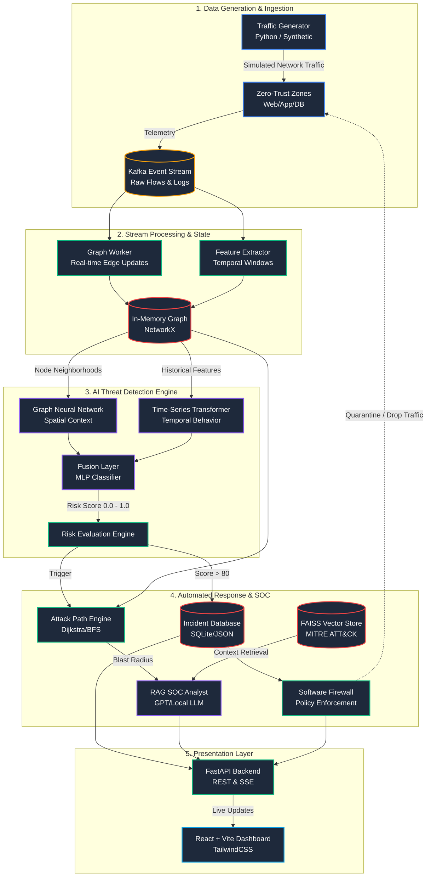

# NetRaptor-X Architecture

## System Design
NetRaptor-X is built on a modular, event-driven architecture simulating a modern Security Operations Center (SOC). It spans from network telemetry generation to automated threat mitigation, leveraging machine learning and generative AI at critical decision points.

## Comprehensive Architecture Diagram

## Component Breakdown

1. **Traffic Generation**: Synthetically generates NetFlow-like telemetry within a micro-segmented network. Injects anomalous lateral movement paths based on probability thresholds.
2. **Stream Processing**: Consumes events and maintains a real-time directed graph of network communications, calculating sliding-window features (degrees, PageRank, bytes).
3. **AI Engine**: A hybrid PyTorch model. The GNN embeds structural topology (who talks to whom), and the Transformer embeds behavioral shifts (how traffic volume changes).
4. **SOC & Containment**: Detects high-risk nodes, reconstructs the attack path to patient-zero, queries a local RAG Knowledge Base to explain the MITRE technique, and triggers a firewall isolation policy.
5. **Dashboard**: Live React interface tracking real-time risk scores, active incidents, and visual topology of the compromised zones.
