# NetRaptor-X Architecture

## Pipeline Overview
The primary intelligence pipeline follows this flow:
Network Flow → Event Stream → Dynamic Graph → Temporal GNN + Transformer → Fusion → Risk Score → Attack Graph + Incident Engine → LLM SOC Analyst → MITRE mapping → Recommended Response → Simulated Containment

## Architecture Diagram

```mermaid
flowchart LR
    NF[Network Flow] --> ES[Event Stream]
    ES --> DG[Dynamic Graph]
    DG --> TGN[Temporal GNN + Transformer]
    TGN --> F[Fusion]
    F --> RS[Risk Score]
    RS --> AGIE[Attack Graph + Incident Engine]
    AGIE --> LSA[LLM SOC Analyst]
    LSA --> MM[MITRE mapping]
    MM --> RR[Recommended Response]
    RR --> SC[Simulated Containment]
```

